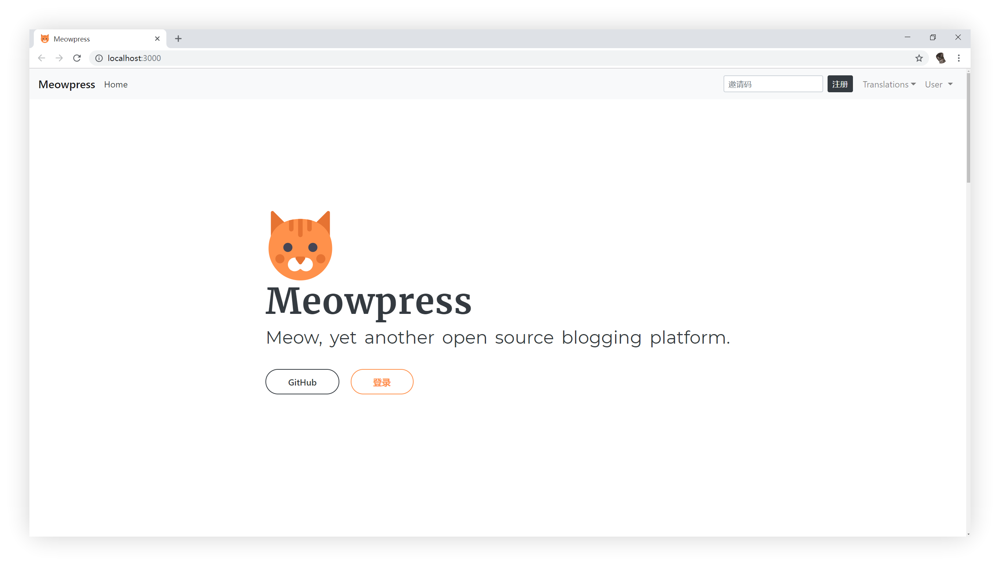

# Meowpress

> Meowpress, an open source blogging platform. Under construction. 🚸



## Tools

We use:

- Vue
- Nuxt.js
- `yarn` as Node.js package manager

## Build Instructions

``` bash
# install dependencies
$ yarn install

# serve with hot reload at localhost:3000
$ yarn run dev

# build for production and launch server
$ yarn run build
$ yarn start

# generate static project
$ yarn run generate
```

For detailed explanation on how things work, checkout [Nuxt.js docs](https://nuxtjs.org).

---

🐱 **Meowpress Home ©Team Meow.** Released under the [MIT License](https://github.com/Meowpress/Meowpress-Home/blob/master/LICENSE).

Authored and maintained by 🐱**Team Meow** with love from BIT.

[@Spencer Woo](https://github.com/spencerwooo) · [@Silvester Wong](https://github.com/silverster98) · [@Tenkey Seven Luo](https://github.com/tenkeyseven) · [@Garvey Lau](https://github.com/garvey98)